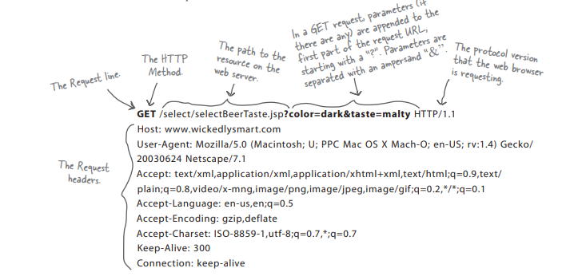
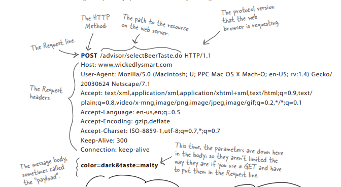
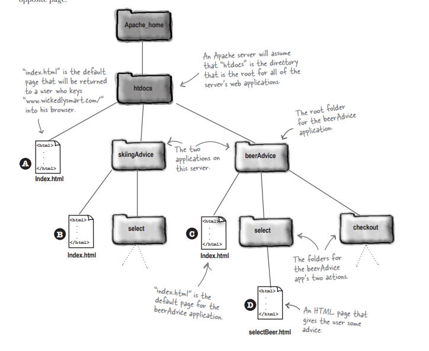
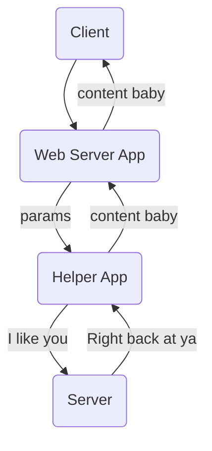
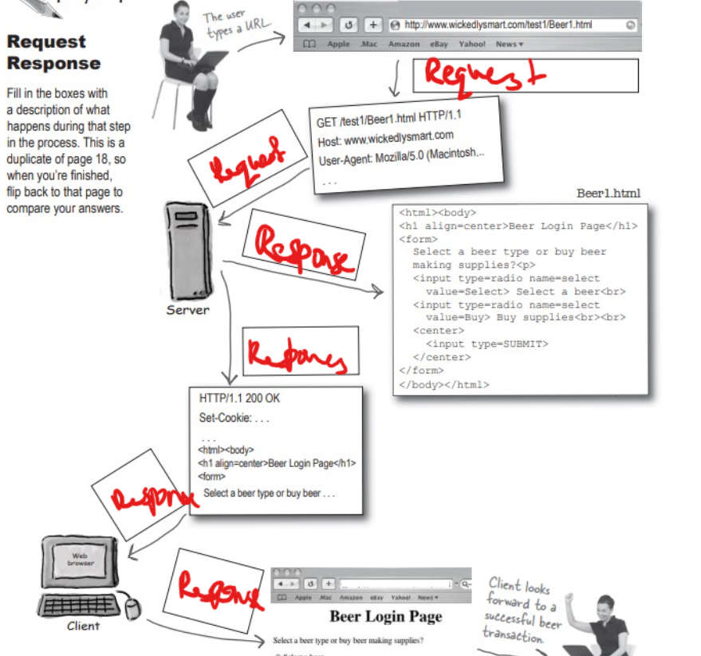

# Head First Servlets and JSP Book

[toc]

# Chapter 1: Introduction

## HTTP

HTTP Request from client to server should get a HTTP Response from the Server to the Client.

HTML can be contained within such responses as it's data posted inside of HTTP responses.

## Requests

GET - I want to get something from the server.

* Is a simple request.
* 

POST - I want to send something to the server, for it to either save, or return something with the input I sent.

* Can send user data.
* 

You don't want users to be able to bookmark a response to a POST.

## Response

MIME type is the content-type that tells the browser what's coming.

## Page 19 Questions

| Question                                                   | Answer (POST or GET)     |
| ---------------------------------------------------------- | ------------------------ |
| A user is returning a login name and password.             | POST                     |
| A user is requesting a new page via a hyperlink            | GET                      |
| A chat room user is sending a written response.            | POST                     |
| A user hits the 'next' button to see the next page.        | GET                      |
| A user hits the 'log out' button on a secure banking site. | GET                      |
| A user hits the 'back button on the browser.'              | GET (if secure use post) |
| A user sends a name and address form to the server.        | POST                     |
| A user makes a radio button selection.                     | POST                     |
|                                                            |                          |

## URL

Protocol://Server:Port:Path/resource

http://www.mywebsite.com:80/whydothis/select/sleepy.html

## TCP

Ports identify what kind of content and required security protocols are required.
You don't get to use 0 to 1023 for yourself as they're already booked by other big peeps.

## P23: URL Mapping Questions



| Page Wanted    | URL Mapping                                                  |
| -------------- | ------------------------------------------------------------ |
| index at pos A | http://www.mywebsite.com:80/htdocs/Index.html                |
| index at pos B | http://www.mywebsite.com:80/htdocs/skiingAdvice/Index.html   |
| index at pos C | http://www.mywebsite.com:80/htdocs/beerAdvice/Index.html     |
| index at pos D | http://www.mywebsite.com:80/htdocs/beerAdvice/select/Index.html |

## What a web server on it's own won't do

1. Dynamic content, such as the current time.
2. Saving data on the server.

To fix this you use a helper program most often called a CGI, which stands for Common Gateway Interface.



## In terms of this project

Servlets and CGI both play the role of a helper app in the web server.
In effect we're replacing traditional CGI scripts with our Servlets and GlassFish handles.

## Page 29 Questions



# Chapter 2: Web App Architecture

## Why Containers

Servlets require the help of managing their own lifecycles.
This is where containers (in our case glassfish) come in.

Servlets don't have a main() method.
They're called by the container (which is another java application), for it's methods such as doPost or doGet.

## What Do The Container Give You?

Communication Support - servlet and web server communications are simplified by the container.

Lifecycle Management - You don't have to worry about resource management, the container controls all of that for you.

Multithreading Support - Not really relevant for us, but still handy.

Declarative Security - XML DD can change security details, without having to deal with Java Source Files.

JSP Support - Can have interactive pages in the forms of these little buggers.

## How Does a Container Handle a Request?

So you make the request to the container, the container then makes a request and a response into a thread that links with the servlet.

The container then calls Servlet methods, and then kills the thread when it's all over.

## Servlet Names

URL Name that is Client Facing : ex /login

Dev Name - LoginServlet

Actual File Name - LoginServlet.class

## Deployment Descriptor URL Mapping

```xml
<web-app...> <!-- This is completely barebones and missing a lot -->
	<servlet>
    	<servlet-name>Internal Name</servlet-name>
    	<serlvet-class>foo.Servlet</serlvet-class> <!-- The .class file without the ender -->
	</servlet>

    <servlet-mapping>
    	<servlet-name>Internal Name</servlet-name>
        <url-pattern>/URLPattern1</url-pattern>
    </servlet-mapping>

</web-app...>
```

## MVC

Model:

* Holds the plain java real business logic, and states.
* Only part that interacts with the DB

Controller:

* Takes input from request and sends it to the model.
* Tells the model to update, makes new state available to view.

View:

* Gets state from controller.
* Takes user inputs.

## Page 58 Question

1. JSP --> View
2. non-servlet Java Class --> Model
3. Servlet --> Controller
4. M stands for Model
5. V stands for View
6. C stands for Controller

## Page 59 Question:

Stars on what I got wrong

| Task                                                         | Web Server, Container, or Servlet |
| ------------------------------------------------------------ | --------------------------------- |
| Create request and response objects                          | Container                         |
| Calls the service() method                                   | Container                         |
| Starts New Thread to handle requests                         | Container                         |
| Converts response to http response                           | Container                         |
| Knows HTTP                                                   | Web Server*                       |
| Adds HTML to response object                                 | Servlet                           |
| Has a ref to response objects                                | Container, Servlet*               |
| Finds URLs in the DD                                         | Container                         |
| Deletes the request and response objects                     | Container                         |
| Co-ordinates making dynamic content                          | Web Server*, Container            |
| Manages Lifecycles                                           | Container                         |
| Has a name that matches the <servlet-class> element in the DD | Servlet                           |


# Chapter 3: Mini MVC Tutorial

## Code added to BeerSelect.java after adding it to the DD through creation.

```java
package Controller;

import java.io.*;
import javax.servlet.http.*;
import javax.servlet.*;

/**
 * @author Yates
 * @date 08/12/2020
 */

public class BeerSelect extends HttpServlet {

    protected void doPost(HttpServletRequest request, HttpServletResponse response)
            throws ServletException, IOException {
        response.setContentType("text/html");
        PrintWriter out = response.getWriter();
        out.println("Beer Selection Advice<br>");
        String c = request.getParameter("color");
        out.println("<br>Got Beer Colour " + c);
    }
}
```


# Chapter 4

# Chapter 5

# Chapter 6

# Chapter 7

# Chapter 8

# Chapter 9

# Chapter 10

# Chapter 11

# Chapter 12

# Chapter 13

# Chapter 14