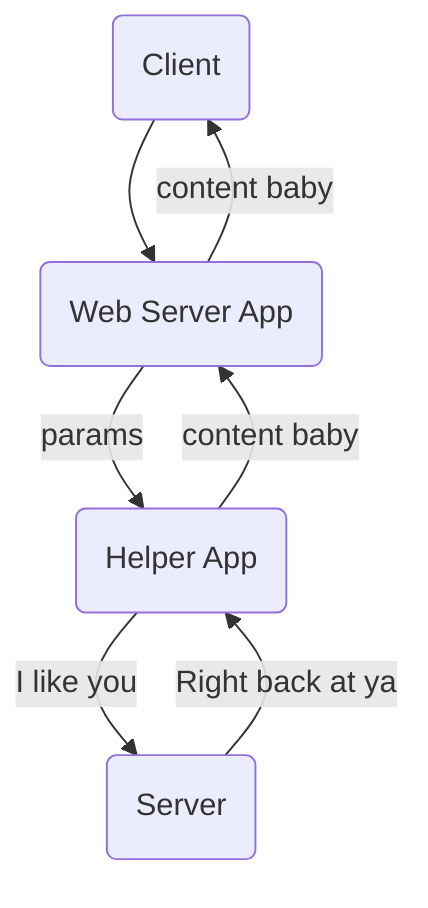

# Head First Servlets and JSP Book

[toc]

# Chapter 1: Introduction

## HTTP

HTTP Request from client to server should get a HTTP Response from the Server to the Client.

HTML can be contained within such responses as it's data posted inside of HTTP responses.

## Requests

GET - I want to get something from the server.

* Is a simple request.
* 

POST - I want to send something to the server, for it to either save, or return something with the input I sent.

* Can send user data.
* 

You don't want users to be able to bookmark a response to a POST.

## Response

MIME type is the content-type that tells the browser what's coming.

## Page 19 Questions

| Question                                                   | Answer (POST or GET)     |
| ---------------------------------------------------------- | ------------------------ |
| A user is returning a login name and password.             | POST                     |
| A user is requesting a new page via a hyperlink            | GET                      |
| A chat room user is sending a written response.            | POST                     |
| A user hits the 'next' button to see the next page.        | GET                      |
| A user hits the 'log out' button on a secure banking site. | GET                      |
| A user hits the 'back button on the browser.'              | GET (if secure use post) |
| A user sends a name and address form to the server.        | POST                     |
| A user makes a radio button selection.                     | POST                     |
|                                                            |                          |

## URL

Protocol://Server:Port:Path/resource

http://www.mywebsite.com:80/whydothis/select/sleepy.html

## TCP

Ports identify what kind of content and required security protocols are required.
You don't get to use 0 to 1023 for yourself as they're already booked by other big peeps.

## P23: URL Mapping Questions

| Page Wanted    | URL Mapping                                                  |
| -------------- | ------------------------------------------------------------ |
| index at pos A | http://www.mywebsite.com:80/htdocs/Index.html                |
| index at pos B | http://www.mywebsite.com:80/htdocs/skiingAdvice/Index.html   |
| index at pos C | http://www.mywebsite.com:80/htdocs/beerAdvice/Index.html     |
| index at pos D | http://www.mywebsite.com:80/htdocs/beerAdvice/select/Index.html |

## What a web server on it's own won't do

1. Dynamic content, such as the current time.
2. Saving data on the server.

To fix this you use a helper program most often called a CGI, which stands for Common Gateway Interface.

## In terms of this project

Servlets and CGI both play the role of a helper app in the web server.
In effect we're replacing traditional CGI scripts with our Servlets and GlassFish handles.

## Page 29 Questions

# Chapter 2: Web App Architecture

# Chapter 3

# Chapter 4

# Chapter 5

# Chapter 6

# Chapter 7

# Chapter 8

# Chapter 9

# Chapter 10

# Chapter 11

# Chapter 12

# Chapter 13

# Chapter 14